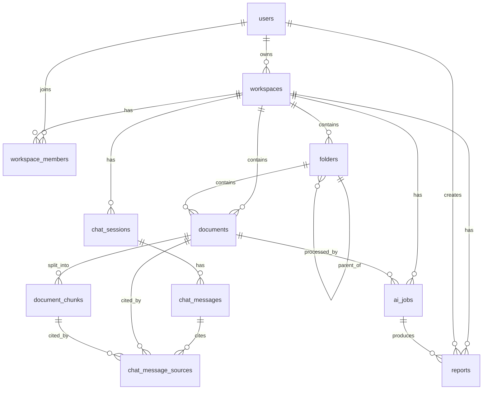

# ERD MVP - InsightVault AI

File này là bản ERD source-of-truth cho MVP của InsightVault AI. Mục tiêu là giúp team hiểu database model trước khi implement code-first bằng ASP.NET Core + EF Core.

## 1. Mục tiêu thiết kế

InsightVault AI là collaborative AI-powered knowledge workspace cho nhóm học tập/project.

MVP cần hỗ trợ:

- Google OAuth login và JWT nội bộ.
- System role: `user`, `admin`.
- Shared workspace với member roles: `owner`, `editor`, `viewer`.
- Folder nhiều cấp trong workspace.
- Upload tài liệu vào MinIO, lưu metadata trong PostgreSQL.
- Background AI jobs cho document processing, compare, report.
- Chunking + embedding + pgvector cho RAG.
- RAG chat theo scope: workspace, folder, document.
- Lưu sources/citations cho câu trả lời AI.
- Lưu Markdown reports, bao gồm summary, comparison, gap/conflict, folder report.
- Soft delete cho dữ liệu user-facing.

## 2. Quyết định đã chốt

| Chủ đề | Quyết định |
|---|---|
| Database | PostgreSQL |
| Vector search | pgvector |
| File storage | MinIO |
| Primary key | `uuid` |
| Backend implementation | EF Core code-first |
| Folder | Hỗ trợ nhiều cấp bằng `parent_folder_id` |
| Delete behavior | Soft delete bằng `deleted_at` cho bảng user-facing |
| Viewer permission | Viewer được hỏi AI trong phạm vi được quyền xem |
| Chat sources | Tách bảng `chat_message_sources` |
| Report source documents | Lưu JSONB trong `reports.source_documents` |
| Embedding model | Gemini embedding model |
| Embedding dimension | `vector(768)` |
| Folder chat scope | Hỏi ở folder cha sẽ include subfolders |
| Auto compare/gap detection | Để sau MVP nếu thiếu thời gian; schema hiện tại không cần đổi lớn |
| Trash UI | Không bắt buộc ngay; schema đã có `deleted_at` để hỗ trợ restore/delete permanently sau |
| Report regeneration | Tạo report mới để giữ lịch sử/version |

## 3. Danh sách bảng

MVP có 11 bảng chính:

1. `users`
2. `workspaces`
3. `workspace_members`
4. `folders`
5. `documents`
6. `document_chunks`
7. `ai_jobs`
8. `chat_sessions`
9. `chat_messages`
10. `chat_message_sources`
11. `reports`

## 4. ERD quan hệ chính



## 5. Bảng và field chính

### 5.1. users

Lưu tài khoản đăng nhập bằng Google OAuth. Hệ thống không lưu password.

| Field | Ghi chú |
|---|---|
| `id` | UUID primary key |
| `google_id` | Định danh Google, unique |
| `email` | Email user, unique |
| `full_name` | Tên hiển thị |
| `avatar_url` | Avatar từ Google |
| `system_role` | `user` hoặc `admin` |
| `is_active` | Admin có thể khóa/mở tài khoản |
| `last_login_at` | Lần đăng nhập gần nhất |
| `created_at`, `updated_at` | Audit timestamps |

### 5.2. workspaces

Lưu workspace do user tạo.

| Field | Ghi chú |
|---|---|
| `id` | UUID primary key |
| `owner_id` | FK tới `users.id` |
| `name` | Tên workspace |
| `description` | Mô tả |
| `is_archived` | Ẩn/lưu trữ workspace |
| `created_at`, `updated_at`, `deleted_at` | Audit + soft delete |

Ghi chú: khi tạo workspace, backend nên tạo luôn một record `workspace_members` cho owner với `role = owner`, `status = active`.

### 5.3. workspace_members

Lưu thành viên và role trong workspace.

| Field | Ghi chú |
|---|---|
| `id` | UUID primary key |
| `workspace_id` | FK tới workspace |
| `user_id` | FK tới user, có thể null khi mới invite |
| `email` | Email được mời |
| `role` | `owner`, `editor`, `viewer` |
| `status` | `invited`, `active`, `removed` |
| `invited_by` | User mời |
| `invited_at`, `joined_at`, `removed_at` | Invite lifecycle |
| `created_at`, `updated_at` | Audit timestamps |

Unique rules:

- Unique `(workspace_id, email)`.
- Unique `(workspace_id, user_id)`.

### 5.4. folders

Lưu folder trong workspace. Folder hỗ trợ nhiều cấp.

| Field | Ghi chú |
|---|---|
| `id` | UUID primary key |
| `workspace_id` | FK tới workspace |
| `parent_folder_id` | FK tự trỏ tới `folders.id`, null nếu là folder gốc |
| `name` | Tên folder |
| `description` | Mô tả |
| `created_by` | User tạo folder |
| `created_at`, `updated_at`, `deleted_at` | Audit + soft delete |

Unique rule:

- Unique `(workspace_id, name)` khi `parent_folder_id IS NULL`, dùng cho folder cấp root.
- Unique `(workspace_id, parent_folder_id, name)` khi `parent_folder_id IS NOT NULL`, dùng cho folder con.

Ví dụ:

```text
Workspace: Nhóm học tập
- Môn A
  - Chương 1
  - Chương 2
  - Bài tập
- Môn B
- Môn C
```

### 5.5. documents

Lưu metadata document. File gốc nằm trong MinIO, không lưu trực tiếp trong database.

| Field | Ghi chú |
|---|---|
| `id` | UUID primary key |
| `workspace_id` | FK tới workspace, giúp check permission/query nhanh |
| `folder_id` | FK tới folder, nullable |
| `uploaded_by` | User upload |
| `file_name` | Tên file dùng trong hệ thống |
| `original_file_name` | Tên file gốc |
| `file_type`, `mime_type` | Loại file |
| `file_size_bytes` | Dung lượng |
| `minio_bucket`, `minio_object_key` | Vị trí file trong MinIO |
| `status` | `uploaded`, `processing`, `completed`, `failed` |
| `summary` | Summary mới nhất |
| `key_points` | JSONB array |
| `keywords` | JSONB array |
| `extracted_text_hash` | Hash text đã extract, dùng cho reprocess sau này |
| `processing_error` | Lỗi xử lý nếu failed |
| `processed_at` | Thời điểm xử lý xong |
| `created_at`, `updated_at`, `deleted_at` | Audit + soft delete |

### 5.6. document_chunks

Lưu chunks và embedding vector cho RAG.

| Field | Ghi chú |
|---|---|
| `id` | UUID primary key |
| `document_id` | FK tới document |
| `workspace_id` | Denormalized để filter RAG nhanh |
| `folder_id` | Denormalized để filter RAG nhanh |
| `chunk_index` | Thứ tự chunk trong document |
| `content` | Nội dung chunk |
| `token_count` | Số token ước tính |
| `char_start`, `char_end` | Vị trí trong text gốc |
| `embedding` | `vector(768)` tạm thời |
| `embedding_model` | Tên model embedding |
| `metadata` | JSONB, ví dụ page number, heading |
| `created_at` | Created timestamp |

Unique rule:

- Unique `(document_id, chunk_index)`.

### 5.7. ai_jobs

Lưu trạng thái các tác vụ AI/background job.

| Field | Ghi chú |
|---|---|
| `id` | UUID primary key |
| `workspace_id` | Workspace liên quan |
| `document_id` | Document liên quan, nullable |
| `created_by` | User tạo job, nullable nếu system tạo |
| `job_type` | `document_processing`, `summary_generation`, `rag_chat`, `document_comparison`, `report_generation` |
| `status` | `queued`, `processing`, `completed`, `failed`, `cancelled` |
| `input_payload` | JSONB input cho worker/AI service |
| `output_payload` | JSONB output hoặc metadata kết quả |
| `error_message` | Lỗi nếu failed |
| `retry_count` | Số lần retry |
| `started_at`, `completed_at` | Thời gian chạy |
| `created_at`, `updated_at` | Audit timestamps |

Lý do cần `ai_jobs`: upload file nên phản hồi nhanh cho user, còn extract/chunk/embedding/summary/compare/report chạy ngầm.

### 5.8. chat_sessions

Lưu một phiên chat theo workspace/folder/document.

| Field | Ghi chú |
|---|---|
| `id` | UUID primary key |
| `workspace_id` | Luôn có để check permission |
| `created_by` | User tạo session |
| `title` | Tên session |
| `scope_type` | `workspace`, `folder`, `document` |
| `scope_workspace_id` | Scope workspace |
| `scope_folder_id` | Scope folder |
| `scope_document_id` | Scope document |
| `include_subfolders` | Mặc định true khi scope là folder |
| `created_at`, `updated_at`, `deleted_at` | Audit + soft delete |

Ghi chú: `scope_*` giúp biết session đang hỏi trong phạm vi nào. Nếu scope là folder, AI retrieve chunks trong folder đó và các folder con.

### 5.9. chat_messages

Lưu tin nhắn trong chat session.

| Field | Ghi chú |
|---|---|
| `id` | UUID primary key |
| `chat_session_id` | FK tới chat session |
| `role` | `user`, `assistant`, `system` |
| `content` | Nội dung message |
| `model_name` | Model AI dùng để trả lời |
| `prompt_tokens`, `completion_tokens` | Token usage nếu lấy được |
| `latency_ms` | Thời gian trả lời |
| `metadata` | JSONB bổ sung |
| `created_at` | Created timestamp |

### 5.10. chat_message_sources

Lưu citations/sources cho câu trả lời của assistant.

| Field | Ghi chú |
|---|---|
| `id` | UUID primary key |
| `chat_message_id` | FK tới assistant message |
| `document_id` | Document được trích dẫn |
| `document_chunk_id` | Chunk được trích dẫn |
| `file_name` | Tên file hiển thị |
| `snippet` | Đoạn trích ngắn |
| `similarity_score` | Score từ vector search |
| `source_order` | Thứ tự hiển thị |
| `created_at` | Created timestamp |

Lý do tách bảng: RAG cần source rõ ràng, có FK tới document/chunk và dễ debug retrieval.

### 5.11. reports

Lưu Markdown report do AI tạo.

| Field | Ghi chú |
|---|---|
| `id` | UUID primary key |
| `workspace_id` | Workspace chứa report |
| `folder_id` | Folder liên quan, nullable |
| `created_by` | User tạo report |
| `ai_job_id` | Job sinh report, nullable |
| `title` | Tiêu đề report |
| `report_type` | `summary_report`, `comparison_report`, `gap_conflict_report`, `folder_report`, `custom_report` |
| `markdown_content` | Nội dung Markdown |
| `source_documents` | JSONB danh sách tài liệu nguồn |
| `structured_result` | JSONB kết quả có cấu trúc |
| `model_name` | Model AI dùng |
| `created_at`, `updated_at`, `deleted_at` | Audit + soft delete |

`source_documents` dùng JSONB trong MVP để linh hoạt, ví dụ:

```json
[
  {
    "documentId": "...",
    "fileName": "proposal.pdf",
    "sourceRole": "primary",
    "sourceOrder": 1
  }
]
```

Nếu sau này cần query mạnh kiểu "document này xuất hiện trong những report nào", có thể tách thêm bảng `report_documents`.

## 6. Permission model

Permission chính dựa vào `workspace_members`.

| Role | Quyền chính |
|---|---|
| `owner` | Manage workspace, members, folders, documents, AI features, reports |
| `editor` | Manage folders/documents, ask AI, compare, generate report |
| `viewer` | View folders/documents/reports, ask AI trong phạm vi được xem |

Admin là system role trong `users.system_role`, dùng để quản lý toàn hệ thống như users, AI jobs, error logs. Admin khác với workspace owner.

## 7. Soft delete rules

Các bảng user-facing dùng `deleted_at`:

- `workspaces`
- `folders`
- `documents`
- `chat_sessions`
- `reports`

Các bảng log/detail không cần soft delete trong MVP:

- `document_chunks`
- `ai_jobs`
- `chat_messages`
- `chat_message_sources`

Trash UI có thể làm sau bằng cách query các record có `deleted_at IS NOT NULL`. Delete permanently sẽ hard delete record và dữ liệu liên quan theo cascade/set-null rule.

## 8. Index gợi ý

Index sẽ được tạo bằng EF Core migration hoặc raw SQL migration khi cần.

Index thường:

- `users(email)`
- `users(google_id)`
- `workspaces(owner_id)`
- `workspace_members(workspace_id, user_id)`
- `workspace_members(workspace_id, email)`
- `folders(workspace_id, name)` filtered by `parent_folder_id IS NULL`
- `folders(workspace_id, parent_folder_id, name)` filtered by `parent_folder_id IS NOT NULL`
- `documents(workspace_id)`
- `documents(folder_id)`
- `documents(status)`
- `document_chunks(document_id)`
- `document_chunks(workspace_id)`
- `document_chunks(folder_id)`
- `ai_jobs(status)`
- `ai_jobs(job_type)`
- `chat_sessions(workspace_id)`
- `chat_messages(chat_session_id)`
- `chat_message_sources(chat_message_id)`
- `reports(workspace_id)`
- `reports(report_type)`

Vector index:

```sql
CREATE INDEX idx_document_chunks_embedding_hnsw
ON document_chunks
USING hnsw (embedding vector_cosine_ops);
```

Ghi chú: HNSW index là phần đặc thù của pgvector. Trong code hiện tại mình config được bằng Fluent API của provider; nếu provider thiếu hỗ trợ ở môi trường khác thì có thể fallback sang raw SQL migration.

## 9. Luồng dữ liệu chính

### 9.1. Login

```text
User login bằng Google
-> Backend nhận Google identity
-> Tạo hoặc cập nhật users
-> Backend phát hành JWT nội bộ
```

### 9.2. Tạo workspace

```text
User tạo workspace
-> Tạo workspaces
-> Tạo workspace_members với role = owner, status = active
```

### 9.3. Upload document

```text
Owner/Editor upload file
-> Backend check workspace permission
-> File lưu vào MinIO
-> Metadata lưu vào documents
-> Tạo ai_jobs type = document_processing
-> UI hiển thị file đã upload và đang processing
```

### 9.4. Xử lý document

```text
Worker lấy ai_job queued
-> Đọc file từ MinIO
-> Extract text
-> Chunk text
-> Generate embedding
-> Lưu document_chunks
-> Generate summary/key_points/keywords
-> Cập nhật documents.status = completed
-> Cập nhật ai_jobs.status = completed
```

### 9.5. RAG chat

```text
User hỏi AI trong workspace/folder/document
-> Backend check workspace membership
-> AI service embed câu hỏi
-> pgvector retrieve chunks theo scope
-> Gemini trả lời dựa trên context
-> Lưu chat_messages
-> Lưu citations vào chat_message_sources
```

### 9.6. Compare hoặc generate report

```text
User chọn documents/folder và bấm compare/report
-> Backend tạo ai_jobs
-> AI service retrieve/prepare context
-> Gemini tạo kết quả
-> Backend lưu Markdown và structured result vào reports
```

Không nên chặn upload để compare ngay lập tức. Nếu cần auto gap/conflict detection sau upload, nên chạy background job ngầm và thông báo sau.

## 10. Quyết định còn lại cho implementation

1. Dùng Gemini embedding model với output dimension 768.
2. Khi hỏi AI ở folder cha, mặc định include subfolders.
3. Auto compare/gap detection sau upload là nice-to-have. Nếu chưa kịp, vẫn giữ schema hiện tại và chỉ làm compare khi user bấm nút trước.
4. Trash UI không bắt buộc trong MVP. `deleted_at` đã đủ để thêm restore/delete permanently sau.
5. Report generate lại sẽ tạo report mới để giữ lịch sử/version.

## 11. Ghi chú triển khai code-first

Team sẽ implement bằng EF Core code-first:

```text
C# Entity -> DbContext config -> EF Core Migration -> PostgreSQL
```

Các phần bình thường như FK, unique constraint, index thường có thể config bằng Fluent API.

Các phần đặc thù như `vector(768)` và HNSW index đã được config trong EF Core. Nếu migration sinh ra thiếu annotation/index mong muốn thì mới cần chỉnh bằng raw SQL.
