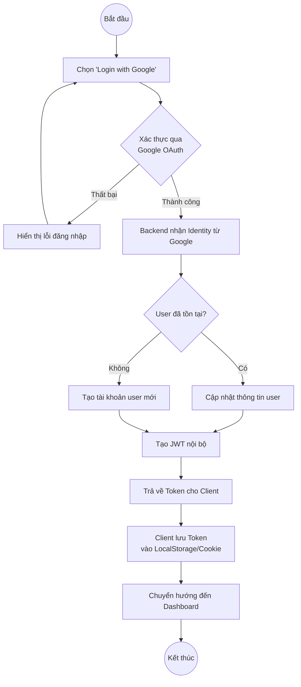
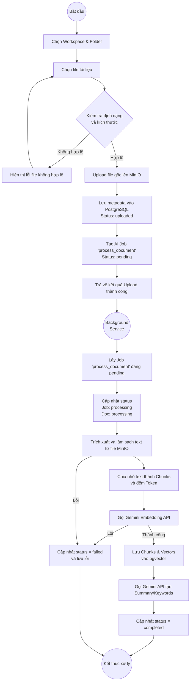

# InsightVault AI - Activity Diagrams

Tài liệu này mô tả các Activity Diagrams cho các luồng quy trình (workflow) chính trong MVP của InsightVault AI, dựa trên file `PROJECT_FEATURES_MVP.md`. Các sơ đồ được vẽ bằng Mermaid.

## 1. Luồng Đăng nhập (Google OAuth Authentication Flow)

Mô tả quá trình người dùng đăng nhập vào hệ thống sử dụng tài khoản Google.



---

## 2. Luồng Tải lên và Xử lý Tài liệu (Document Upload & Background Processing Flow)

Mô tả quá trình người dùng upload file, lưu trữ file và hệ thống background tự động xử lý (chunking, embedding, summary).



---

## 3. Luồng Hỏi đáp RAG (RAG Chat Flow)

Mô tả quá trình người dùng đặt câu hỏi và AI tìm kiếm ngữ cảnh từ tài liệu để trả lời (Retrieval-Augmented Generation).

```mermaid
flowchart TD
    Start((Bắt đầu)) --> ChooseScope[Chọn Phạm vi (Scope)\nWorkspace / Folder / Document]
    ChooseScope --> EnterQuery[Nhập câu hỏi (Query)]
    EnterQuery --> CreateChatMsg[Lưu Chat Message vào DB]
    CreateChatMsg --> GenQueryEmbedding[Tạo Embedding cho Query\n(Gemini Embedding API)]
    GenQueryEmbedding --> VectorSearch[Tìm kiếm Semantic Search pgvector\n(Lọc theo quyền và Scope)]
    VectorSearch --> GetContext[Lấy Top-K Chunks liên quan nhất]
    GetContext --> BuildPrompt[Xây dựng Prompt\n(System Prompt + Context + Query)]
    BuildPrompt --> CallGemini[Gọi Gemini API sinh câu trả lời]
    CallGemini --> ReceiveResponse[Nhận câu trả lời từ AI]
    ReceiveResponse --> SaveResponse[Lưu câu trả lời và Sources vào DB]
    SaveResponse --> DisplayResult[Hiển thị câu trả lời & Trích dẫn cho User]
    DisplayResult --> End((Kết thúc))
```

---

## 4. Luồng So sánh Tài liệu và Tạo Report (Document Comparison & Report Generation Flow)

Mô tả quá trình người dùng chọn nhiều tài liệu để AI tự động so sánh, phân tích gap/conflict và tạo báo cáo Markdown.

```mermaid
flowchart TD
    Start((Bắt đầu)) --> SelectDocs[Chọn 2 hoặc nhiều Documents]
    SelectDocs --> ClickCompare[Nhấn 'Compare' / 'Generate Report']
    ClickCompare --> ChooseType[Chọn loại Report\n(VD: Comparison, Gap Analysis)]
    ChooseType --> RequestCompare[Gửi yêu cầu tạo Report]
    RequestCompare --> CreateReportJob[Tạo AI Job 'generate_report']
    CreateReportJob --> ReturnJobId[Trả về Job ID cho Client]
    ReturnJobId --> BackgroundWorker((Background\nWorker))

    BackgroundWorker --> JobRun[Lấy Job 'generate_report']
    JobRun --> GetDocContent[Lấy nội dung (Summary/Chunks)\ncủa các Documents đã chọn]
    GetDocContent --> BuildComparePrompt[Tạo Prompt so sánh / phân tích]
    BuildComparePrompt --> CallAICompare[Gọi Gemini API]
    CallAICompare --> ReceiveMarkdown[Nhận kết quả định dạng Markdown]
    ReceiveMarkdown --> SaveReport[Lưu Report vào bảng reports]
    SaveReport --> UpdateJobState[Cập nhật Job status = completed]
    UpdateJobState --> EndWorker((Kết thúc xử lý))

    ReturnJobId -. Client polling/socket .-> CheckStatus{Job đã xong?}
    CheckStatus -- Xong --> ViewReport[User xem nội dung Report]
    CheckStatus -- Chưa --> CheckStatus
```

---

## 5. Luồng Quản lý Workspace & Member (Workspace & Member Management Flow)

Mô tả quy trình tạo Workspace và mời thành viên cùng làm việc.

```mermaid
flowchart TD
    Start((Bắt đầu)) --> UserAction{User chọn hành động}
    
    UserAction -- Tạo Workspace --> CreateWS[Nhập thông tin Workspace]
    CreateWS --> SaveWS[Lưu vào DB\nGán User hiện tại làm Owner]
    SaveWS --> WSReady((Workspace\nsẵn sàng))
    
    UserAction -- Mời Member --> EnterEmail[Nhập Email & chọn Role\n(Editor/Viewer)]
    EnterEmail --> CheckOwner{User có quyền Owner?}
    CheckOwner -- Không --> ErrorPerm[Báo lỗi không đủ quyền]
    CheckOwner -- Có --> SaveMember[Thêm vào workspace_members]
    SaveMember --> SendInviteEmail[Gửi Email thông báo (Optional)]
    SendInviteEmail --> MemberAdded((Thành viên\nđược thêm))
```
