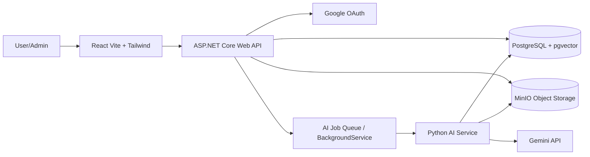

# InsightVault AI - Team Execution Architecture Plan

## 1. Chốt scope MVP

MVP nên đi theo hướng **shared workspace + AI document analysis**.

Lý do: đây là điểm khác biệt chính so với Google Drive, Obsidian và chatbot upload-file đơn lẻ.

Luồng giá trị cần demo được:

```text
Login -> Create shared workspace -> Invite member -> Upload documents
-> Process/chunk/embed -> Summary -> RAG chat -> Compare/gap detection
-> Generate Markdown report -> Admin monitors jobs
```

## 2. Kiến trúc hệ thống



### Thành phần chính

| Layer | Công nghệ | Trách nhiệm |
|---|---|---|
| Frontend | React Vite, Tailwind | UI auth, workspace, upload, chat, report, dashboard |
| Backend API | ASP.NET Core Web API | Auth, permission, CRUD, upload, job orchestration |
| Database | PostgreSQL + pgvector | Metadata, user, workspace, chunks, embeddings, reports |
| File storage | MinIO | Lưu file gốc |
| AI service | Python | Extract text, chunking, embedding, RAG, compare, report |
| AI provider | Gemini API | Embedding, summary, answer, compare, report generation |
| Background job | .NET BackgroundService + ai_jobs; RabbitMQ optional | Xử lý tác vụ lâu, retry, tracking lỗi |

Khuyến nghị MVP: dùng `PostgreSQL ai_jobs + .NET BackgroundService` làm mặc định; chỉ thêm RabbitMQ nếu team còn thời gian hoặc cần điểm system design tốt hơn.

## 3. Core feature

### P0 - Bắt buộc để MVP thành công

1. Google OAuth + JWT.
2. Workspace CRUD.
3. Workspace member roles: `owner`, `editor`, `viewer`.
4. Folder CRUD.
5. Upload PDF/DOCX/TXT/Markdown vào MinIO.
6. Tạo `process_document` job sau upload.
7. Extract text, chunk, embedding, lưu vào `document_chunks`.
8. Summary/key points/keywords cho document.
9. RAG chat theo scope `document`, `folder`, `workspace`.
10. Compare 2 documents và phát hiện gap/conflict.
11. Generate Markdown report và lưu DB.
12. User dashboard + admin job monitoring cơ bản.

### P1 - Làm nếu còn thời gian

- Retry failed job từ UI.
- Citation/source hiển thị rõ hơn.
- Document preview.
- Activity log workspace.
- Usage stats/token logs cơ bản.

### Out of scope MVP

- Realtime editing.
- OCR file scan.
- Export PDF/DOCX.
- Mobile app.
- Billing/payment.
- Version control phức tạp.
- Knowledge graph nâng cao.

## 4. Database scope

MVP dùng các bảng chính:

```text
users
workspaces
workspace_members
folders
documents
document_chunks
ai_jobs
chat_sessions
chat_messages
reports
```

Điểm bắt buộc:

- `workspace_members` là nguồn phân quyền trong workspace.
- `documents.status`: `pending_upload`, `uploaded`, `processing`, `completed`, `failed`.
- `ai_jobs.status`: `queued`, `processing`, `completed`, `failed`, `cancelled`.
- `document_chunks.embedding`: pgvector, ví dụ `vector(768)`.
- `chat_messages.sources_json`: lưu chunk/document source cho câu trả lời.
- `reports.report_type`: dùng chung cho `summary_report`, `comparison_report`, `gap_analysis_report`.

## 5. API module đề xuất

| Module | API chính |
|---|---|
| Auth | Google login callback, refresh/current user |
| Workspace | create/list/detail/update/delete |
| Member | invite/list/change role/remove |
| Folder | create/list/update/delete |
| Document | upload/list/detail/delete/status |
| Job | list/detail/retry failed |
| Chat | create session, send message, list history |
| Compare | compare documents, get result |
| Report | generate/list/detail/delete |
| Admin | users, jobs, failed jobs, error logs |

## 6. Sprint plan cho team

### Sprint 0 - Foundation

Deliverables:

- Repo structure: `frontend`, `backend`, `ai-service`, `infra`.
- Docker Compose: PostgreSQL, pgvector, MinIO, RabbitMQ nếu dùng.
- ASP.NET solution + EF Core + migration đầu tiên.
- React Vite app shell.
- Python AI service skeleton.
- Health check API.

### Sprint 1 - Auth + Workspace

Deliverables:

- Google OAuth login.
- JWT middleware.
- `users`, `workspaces`, `workspace_members`.
- Workspace CRUD.
- Invite/manage member basic flow.
- FE login/workspace/member pages.

### Sprint 2 - Folder + Upload

Deliverables:

- Folder CRUD.
- Upload API.
- Validate file type/size.
- MinIO integration.
- Document metadata.
- Auto-create `process_document` job.
- FE upload/status UI.

### Sprint 3 - Processing Pipeline

Deliverables:

- Worker lấy queued jobs.
- Extract PDF/DOCX/TXT/Markdown.
- Clean/chunk text.
- Gemini embedding.
- Save chunks + vectors.
- Update document status.
- Error handling + retry count.

### Sprint 4 - Summary + RAG

Deliverables:

- Generate summary/key points/keywords.
- Chat session/message APIs.
- Retrieval theo document/folder/workspace.
- Gemini answer generation.
- Save sources.
- FE chat UI + source display.

### Sprint 5 - Compare + Reports

Deliverables:

- Compare 2 documents.
- Prompt compare/gap/conflict.
- Save comparison as report.
- Generate Markdown report.
- Report list/detail UI.
- Compare UI.

### Sprint 6 - Dashboard + Admin

Deliverables:

- User dashboard.
- Admin dashboard.
- Job list/failed job view.
- Retry failed job.
- Basic error logs.

### Sprint 7 - Testing + Demo

Deliverables:

- Test critical API flows.
- Seed demo data.
- Prepare fallback nếu Gemini lỗi.
- UI polish.
- Demo script end-to-end.

## 7. Phân công team 6 người

| Role | Ownership | Output |
|---|---|---|
| BE1 - Backend lead | Auth, JWT, user/admin role, workspace, member permission | Auth + RBAC chạy ổn |
| BE2 - Backend infra | Docker, DB, MinIO, job queue/worker, upload, retry | Upload + job pipeline chạy ổn |
| BE3 - AI engineer | Python service, extraction, chunking, embedding, RAG, compare/report | AI pipeline end-to-end |
| FE1 - Frontend lead | App shell, routing, auth UI, component system | FE foundation ổn |
| FE2 - Workspace/document UI | Workspace, member, folder, upload, document detail | Document flow hoàn chỉnh |
| FE3 - AI/dashboard UI | Chat, compare, report, dashboard, admin pages | AI features dùng được từ UI |

## 8. Quy tắc kỹ thuật

- Mọi API nghiệp vụ phải kiểm tra JWT.
- Mọi truy vấn document/chunk/report phải filter theo workspace permission.
- Không expose MinIO object public trực tiếp.
- Upload request chỉ lưu file + tạo job, không xử lý AI đồng bộ.
- AI answer phải lưu `sources_json`.
- Compare/report nên lưu output Markdown để dễ demo.
- Khi Gemini timeout/lỗi, cập nhật `ai_jobs.status = failed` và lưu `error_message`.

## 9. Definition of Done

MVP hoàn thành khi demo được:

1. User login Google.
2. Owner tạo workspace và mời member.
3. Editor upload 2 tài liệu.
4. Worker xử lý xong document.
5. User xem summary.
6. User hỏi AI theo workspace/folder/document.
7. User compare proposal và requirement.
8. AI chỉ ra gap/conflict.
9. User generate Markdown report.
10. Admin xem job status và failed jobs.

## 10. Rủi ro chính

| Rủi ro | Cách xử lý |
|---|---|
| Scope co-work làm MVP nặng | Giữ role đơn giản: owner/editor/viewer, chưa làm realtime |
| Gemini API chậm/lỗi | Background job + retry + fallback demo data |
| RAG trả lời sai context | Strict scoped retrieval + sources_json |
| Upload file lớn | Giới hạn size MVP + xử lý async |
| Permission bug | Centralize permission service ở backend |
